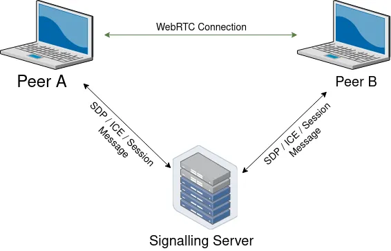
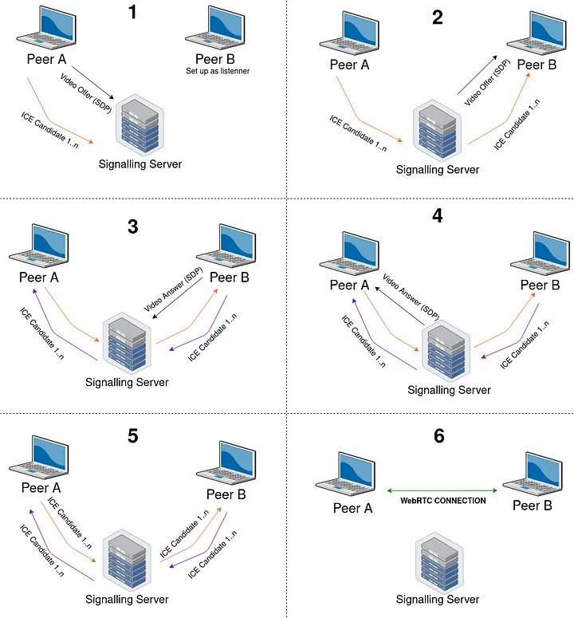

# Overview

I want to learn Rust Programming Language, and to learn to program in Web Assembly, wasm-bindgen and web_sys. I want to learn about Web Socket, Signaling Servers, Javascript, Cargo-make and C++.

I wrote a program that is divided in:

- Shared Protocol (Messages between Signaling Server and Wasm-client)
- Signaling Server (Sends video answer, video offer, ice candidates, and establish a RTCPeerConnection)
- Web Assembly Client (There are a websocket connection between Signaling Server and Wasm-client)

We can connect from one computer, with a navigator, to (IP):9000, allow camera, and click in Connect to Session. Then connect from another computer, with a navigator, to to (IP):9000, allow camera, look at the Session ID, on the first computer, enter in the input the Session ID, and click Join to the Session. The result is that we have a video transference or streaming, between one computer and other (Peer A and Peer B).

You can find the IP address from the Wasm-client by running (in the same computer you are running the Wasm-client), this command on terminal:

```
ifconfig
```

This program is tested on Linux

# How to use

You have to install the following:

- Rust
- Cargo
- Cargo-make
- Microserver

```
cargo install --force cargo-make
cargo install microserver
```

Then, go to the signaling server folder, and run:

```
cargo make servesignal
```

Next, go to the wasm_client folder, and run:

```
cargo make build
cargo make serve
```

We can connect from one computer, with a navigator, to (IP):9000, allow camera, and click in Connect to Session. Then connect from another computer, with a navigator, to to (IP):9000, allow camera, look at the Session ID, on the first computer, enter in the input the Session ID, and click Join to the Session. The result is that we have a video transference or streaming, between one computer and other (Peer A and Peer B).

You can find the IP address from the Wasm-client by running (in the same computer you are running the Wasm-client), this command on terminal:

```
ifconfig
```

If you are trying to connect to a local address, like 192.168.1.35, Google Chrome will not allow camera. So, you have to access via HTTPS. You have to create a local security certificate with OpenSSL.

I want to develop complex software with peer to peer technology, like Zoom.

{Provide a link to your YouTube demonstration.  It should be a 4-5 minute demo of the software running (you will need to show two pieces of software running and communicating with each other) and a walkthrough of the code.}

[Software Demo Video](http://youtube.link.goes.here)

# Network Communication

I used Peer to Peer architecture.

- Peer A sends Video Offer to Peer B
- Peer B sends Video Answer to Peer A
- Between Peers, they have the ICE Candidates of the other peer

Establishing a RTCPeerConnection

They add their own Media Streams to the connection, each Peer gets notified that the other Peer has added a Media stream to the connection. The RtcIceConnectionState changes to Connected, callbacks are triggered, the streams are output to a video element and video is transmitted between the peers.

<h1 align="center">
 <a></a>
 </h1>

<h1 align="center">
 <a></a>
 </h1>

I am using both, because we need to establish a session with UDP. For Client, we are using port 9000.
For Websocket, we are using port 2794.

Signaling Protocol:

```
// Return called by the server as soon as the user connects
NewUser(UserID),

// To manage a live session between two users
SessionNew,
SessionReady(SessionID),
SessionJoin(SessionID),
SessionJoinSuccess(SessionID),
SessionJoinError(SessionID),

// When Connecting to a Session
VideoOffer(String, SessionID),
VideoAnswer(String, SessionID),
IceCandidate(String, SessionID),
ICEError(String, SessionID),

//
Debug,
```

# Development Environment

I used:

- Rust
- WebRTC
- Websocket
- Wasm-bindgen
- web_sys
- Cargo-make
- Microserver
- async-tungstenite

Rust is a general purpose programming language, is compiled, and is low-memory, what makes it a wonderful language. It is based on functions, structures, implementations, traits, and other things.

I used WebRTC Rust, that is a driver to manage Peer to Peer Connections, once they are established.

Websocket is a Javascript or Wasm socket that connects one point to another. This is full-duplex, and it is established on a IP and a port.

Wasm-bindgen is a high level implementation of Web Assembly, in Rust.

Web-sys allows to work easily with Javascript.

Cargo-make allows to run tasks or build things on Rust.

Microserver allows to serve Wasm clients on a IP and a PORT.

Async-tungstenite allows to manage asynchronous tasks.

# Useful Websites

* [Rust](https://www.rust-lang.org/)
* [WebRTC](https://github.com/webrtc-rs/webrtc)
* [Websocket](https://developer.mozilla.org/en-US/docs/Web/API/WebSockets_API)
* [Wasm-bindgen](https://github.com/rustwasm/wasm-bindgen)
* [web_sys](https://rustwasm.github.io/wasm-bindgen/api/web_sys/)
* [Cargo-make](https://docs.rs/crate/cargo-make/0.3.35)
* [Microserver](https://crates.io/crates/microserver)
* [Async-tungstenite](https://crates.io/crates/async-tungstenite)

# Future Work

* Streaming Video and Audio as well
* Make a better GUI, with QT, or other front-end technology
* Make other type of message, like chat messages, or keyboard / mouse controlling